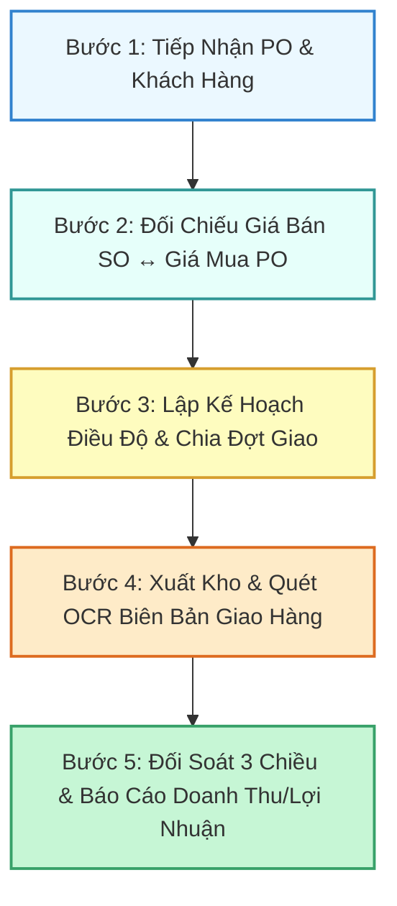

# 🏢 TSG Business OS — Enterprise ERP & Logistics Intelligence (2026)

<div align="center">


**Hệ Điều Hành Doanh Nghiệp & Trung Tâm Điều Độ Logistics Toàn Diện Cho Tập Đoàn Tâm Sen**

[](https://react.dev/)
[](https://www.typescriptlang.org/)
[](https://tailwindcss.com/)
[](https://ai.google.dev/)
[](https://developers.google.com/drive)
[](https://firebase.google.com/)

[Tính Năng Nổi Bật](#-tính-năng-nổi-bật) • [Quy Trình 5 Bước](#-quy-trình-nghiệp-vụ-5-bước-khép-kín) • [Kiến Trúc Kỹ Thuật](#-kiến-trúc-kỹ-thuật--csdl) • [Cài Đặt & Triển Khai](#-hướng-dẫn-cài-đặt--chạy-cục-bộ) • [Cẩm Nang Sử Dụng](#-cẩm-nang-sử-dụng-hệ-thống)

</div>

---

## 📖 Giới Thiệu Tổng Quan

**TSG Business OS** là nền tảng quản trị nguồn lực doanh nghiệp (ERP) thế hệ mới được thiết kế đặc thù cho các hoạt động thương mại, phân phối, sản xuất và điều độ logistics của **Tập Đoàn Tâm Sen**. 

Hệ thống hợp nhất toàn bộ dòng chảy dữ liệu kinh doanh: Từ quản lý bảng giá niêm yết 2026, hợp đồng nguyên tắc, đơn đặt hàng PO, chia lịch điều độ xe 4 tầng, quét bóc tách chứng từ OCR bằng AI thị giác Gemini Vision, đến tự động phân bổ doanh thu, tính giá vốn (COGS), biên lợi nhuận gộp và quản lý kho lưu trữ đám mây Google Drive.

---

## 🌟 Tính Năng Nổi Bật

### 1. 🚚 Trung Tâm Điều Độ & Kế Hoạch Giao Hàng 360° (`LogisticsHubView`)
* **Lịch Giao Nhận Trực Quan 4 Tầng**: Xem tiến độ giao theo Năm $\rightarrow$ Tháng $\rightarrow$ Tuần $\rightarrow$ Ngày với thẻ sự kiện tương tác trực tiếp.
* **Cây Kế Hoạch Điều Độ Phân Cấp**: Quản lý Đơn hàng PO $\rightarrow$ Kế hoạch $\rightarrow$ Chia nhiều đợt giao linh hoạt (Multi-batching) theo tải trọng xe.
* **Sổ Xuất Kho PXK**: Kiểm soát chi tiết phiếu xuất kho, tài xế, biển số xe, doanh thu và biên lợi nhuận từng chuyến hàng.
* **Ma Trận Đối Soát 3 Chiều**: Tự động cân bằng 4 cột số liệu: $\text{Đặt (PO)} \leftrightarrow \text{Kế Hoạch} \leftrightarrow \text{Thực Giao (PXK)} \leftrightarrow \text{Còn Lại}$ kèm xuất báo cáo Excel 1-click.

### 2. 📷 Bóc Tách OCR & Tự Động Định Giá Đa Bảng (`OCRView`)
* **Gemini 2.5 Flash Vision AI**: Nhận diện siêu tốc các loại phiếu xuất kho, biên bản bàn giao, hóa đơn VAT hoặc PO.
* **Tự Động Khớp Bảng Giá 2026**: Tự động nhận diện mã sản phẩm, liên kết mã giá (`Gsp_...`), hợp đồng căn cứ, đơn giá bán và đơn giá mua (COGS).
* **Bảng Chọn Giá Nổi Trung Tâm (Dedicated Price Selector Modal)**: Cho phép tìm kiếm nhanh, tra cứu biên lợi nhuận và thay đổi bảng giá linh hoạt mà không bị giới hạn chiều cao.
* **Đồng Bộ Dữ Liệu Liên Hoàn**: Khi bấm lưu, hệ thống tự động ghi nhận vào `deliveries`, cập nhật `po_lines`, đổi trạng thái `delivery_plans` sang Hoàn thành và tải file scan lên Google Drive.

### 3. 📂 Kho Tệp Google Drive & Sổ Đối Soát 2 Bên (`StorageView`)
* **Tự Động Tạo Cấu Trúc Thư Mục**: `TSG_Business_Documents / 2026 / [Loại_Chứng_Từ] / Thang_[XX]`.
* **Cơ Chế Double-Check**: Đối soát 2 chiều giữa Kế toán và Giám đốc (Trạng thái: 🟢 *Đã khớp 100%* | 🟡 *Chờ rà soát* | 🔴 *Lệch số liệu*).
* **Xác Thực 1 Lần (Session OAuth Token)**: Đăng nhập Google Drive an toàn, bảo mật token trong phiên làm việc.

### 4. 🏢 Bàn Làm Việc & Báo Cáo Điều Hành (`DashboardView`)
* **Hệ Thống Thẻ Bento KPI Chuẩn Google Looker**: Doanh thu, Lợi nhuận gộp, Tỷ lệ hoàn thành đơn hàng, Công nợ, Tồn kho.
* **Số Liệu Thẳng Hàng Tabular Figures**: Toàn bộ số liệu tài chính sử dụng typography tỷ lệ thuận `Roboto Condensed / Inter` với OpenType `tabular-nums`.

### 5. 🤖 Trợ Lý Thông Minh Gemini Copilot (`AssistantView`)
* Trực tiếp truy vấn dữ liệu từ 13 bảng cơ sở dữ liệu thời gian thực.
* Trả lời câu hỏi phân tích kinh doanh, dự báo nhu cầu giao hàng và đề xuất tối ưu chi phí.

---

## ⚡ Quy Trình Nghiệp Vụ 5 Bước Khép Kín



---

## 🏗️ Kiến Trúc Kỹ Thuật & CSDL

### Tech Stack
* **Frontend**: React 19, TypeScript, Tailwind CSS v4, Lucide Icons, Canvas Confetti, Chart.js.
* **AI Vision & NLP**: Google Gemini 2.5 Flash Vision API (`@google/genai`).
* **Cloud Storage & Sync**: Google Drive REST API v3, Firebase Firestore.
* **Local Engine**: IndexedDB Double Storage Engine (đảm bảo an toàn dữ liệu 100% ngoại tuyến).
* **Build & Dev**: Vite 6, ESBuild Node Server.

### 13 Bảng Cơ Sở Dữ Liệu Đồng Bộ
1. `pricing` — Bảng giá bán & giá vốn 2026
2. `contracts` — Hợp đồng nguyên tắc & phụ lục
3. `po_headers` — Thông tin chung đơn hàng PO
4. `po_lines` — Dòng chi tiết sản phẩm đơn hàng
5. `delivery_plans` — Kế hoạch điều độ & đợt giao
6. `deliveries` — Sổ giao hàng thực tế (PXK)
7. `customers` — Hồ sơ khách hàng & đối tác
8. `suppliers` — Danh mục nhà cung cấp
9. `products` — Danh mục sản phẩm
10. `specs` — Tiêu chuẩn kỹ thuật sản phẩm
11. `contacts` — Danh bạ liên hệ 2 bên
12. `commissions` — Chính sách hoa hồng kinh doanh
13. `file_storage` — Quản lý metadata tệp Google Drive

---

## 🚀 Hướng Dẫn Cài Đặt & Chạy Cục Bộ

### 1. Yêu Cầu Môi Trường
* **Node.js**: Phiên bản `>= 18.0.0` (Khuyên dùng Node 20+)
* **npm** hoặc **yarn** / **pnpm**

### 2. Cài Đặt Thư Viện
```bash
git clone https://github.com/nguyenthanhtam211-beep/TSGnew.git
cd TSG-Business---New
npm install
```

### 3. Cấu Hình Biến Môi Trường (`.env.local`)
Tạo tệp `.env.local` ở thư mục gốc và khai báo các khóa API:
```env
# Google Gemini Vision API Key
VITE_GEMINI_API_KEY=your_gemini_api_key_here

# Google Drive OAuth Client ID (Tùy chọn cho tính năng tải lên Drive)
VITE_GOOGLE_CLIENT_ID=your_google_oauth_client_id.apps.googleusercontent.com

# Firebase Configuration (Tùy chọn đồng bộ đám mây)
VITE_FIREBASE_API_KEY=your_firebase_api_key
VITE_FIREBASE_AUTH_DOMAIN=your_project.firebaseapp.com
VITE_FIREBASE_PROJECT_ID=your_project_id
VITE_FIREBASE_STORAGE_BUCKET=your_project.appspot.com
VITE_FIREBASE_MESSAGING_SENDER_ID=your_messaging_sender_id
VITE_FIREBASE_APP_ID=your_app_id
```

### 4. Khởi Chạy Ứng Dụng
```bash
# Khởi chạy máy chủ phát triển
npm run dev

# Hoặc biên dịch & đóng gói sản phẩm hoàn chỉnh
npm run build
```

Mở trình duyệt tại địa chỉ: `http://localhost:5173`

---

## 📚 Cẩm Nang Sử Dụng Hệ Thống

| Mục | Thao Tác Chính | Phím Tắt / Gợi Ý |
| :--- | :--- | :--- |
| **Bàn Làm Việc** | Theo dõi tổng quan doanh thu, lợi nhuận, biểu đồ luồng tiền | `⌘W` để quay lại Dashboard |
| **Logistics 360°** | Chuyển đổi giữa Lịch 4 tầng, Kế hoạch điều độ, Sổ PXK & Đối soát 3 chiều | Bấm vào sự kiện lịch để mở chi tiết |
| **Quét OCR** | Tải ảnh phiếu xuất kho $\rightarrow$ AI tự động bóc tách $\rightarrow$ Chọn bảng giá $\rightarrow$ Lưu | Tự động đồng bộ sang 4 bảng CSDL |
| **Bảng Giá & HĐ** | Tra cứu giá bán theo khách hàng, tính % biên lợi nhuận, quản lý hợp đồng | Tìm kiếm nhanh theo mã SKU / tên SP |
| **Kho Lưu Trữ** | Xem cây thư mục Drive theo năm/tháng, kiểm tra trạng thái đối soát | Đăng nhập Google 1 lần trong phiên |
| **Trợ Lý AI** | Đặt câu hỏi bằng tiếng Việt tự nhiên về số liệu kinh doanh | Bấm vào biểu tượng robot ở góc trên |

---

## 🛡️ Bản Quyền & Phát Triển
Phát triển và vận hành bởi **Tập Đoàn Tâm Sen (Tâm Sen Group)**.
Mọi quyền được bảo lưu © 2026.
